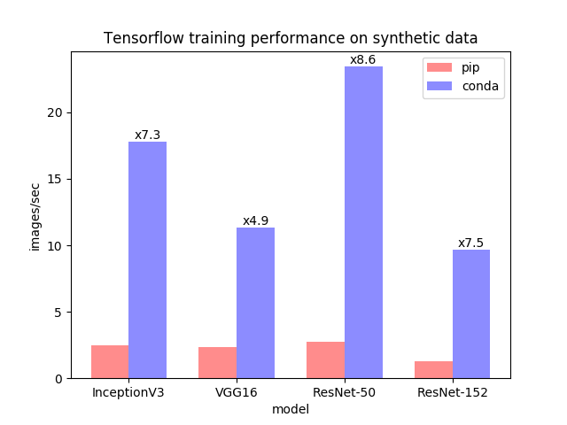

## Why should I use a package and environment management system?

Installing software is hard. Installing scientific software (including all required dependencies 
of said software!) is often even more challenging. In order to minimize the burden of installing 
and updating software (data) scientists often install software packages that they need for their 
various projects system-wide. 

Installing software system-wide has a number of drawbacks:

*   can be difficult to figure out what software is required for any particular research project
*   often impossible to install different versions of the same software package at the same time
*   updating software required for one project can often "break" the software installed for another 
    project

Put differently, installing software system-wide creates complex dependencies between your reearch 
projects that shouldn't really exist!

Rather than installing software system-wide, wouldn't it be great if we could install software 
separately for each research project?

> ## Discussion
> 
> What are some of the _potential_ benefits from installing software separately for each project? 
> What are some of the _potential_ costs?
> 
> > ## Solution
> > 
> > Notice that many of the potential benefits from installing software separately for each 
> > project require the ability to isolate the projects' software environments from one another. 
> > Also, once you have figured out how to isolate project-specific software environments, you 
> > will still need to have some way to manage software packages appropriately.
> {: .solution} 
{: .challenge}

### Package management

A good package management system greatly simplifies the process of installing software by 

1.  identifying and installing compatible versions of software and all required dependencies. 
2.  handling the process of updating software as more recent versions become available.

If you use some flavor of Linux, then you are probably familiar with the package manager for your 
Linux distribution (i.e., `apt` on Ubuntu, `yum` on CentOS); if you are a Mac OS user then you 
might be familiar with the [Home Brew Project](https://brew.sh/) which brings a Linux-like package 
management system to Mac OS; if you are a Windows OS user, then you may not be terribly familiar 
with package managers as there isn't really a standard package manager for Windows (although there 
is the [Chocolatey Project](https://chocolatey.org/)).  

Operating system package management tools are great but these tools actually solve a more general 
problem than you often face as a (data) scientist.  As a (data) scientist you typically use one or 
two core scripting languages (i.e.,  Python, R, SQL). Each scripting language has multiple 
versions that can potentially be installed and each scripting language will also have a large 
number of third-party packages (and additional dependencies) that will need to be installed. The 
exact version of your core scripting language(s) and additional, third-party packages will also 
probably change from project to project.

Both the Python and R communities have their own "default" package management systems.

*   [`pip`](https://pip.pypa.io/en/stable/) is the standard package management system for Python.
*   `install.packages`, which is part of the R standard library, is the default package management 
    system for R.

### Environment management

An environment management system solves a number of problems commonly encountered by (data) 
scientists.

*   An application you need for a research project requires different versions of Python (R) or 
    different versions of various Python (R) packages from the versions that you are currently using.
*   An application you developed as part of a previous research project that worked fine on your 
    system six months ago now no longer works.
*   Code that have written for a joint research project works on your machine but not on your 
    collaborators' machines.
*   A machine learning application that you are developing on your local machine doesn't provide 
    the same results when run on your remote cluster.

An environment management system enables you to set up a new, project specific software environment 
containing specific Python (R) versions as well as the versions of additional packages and 
required dependencies that are all mutually compatible.

*   Environment management systems help resolve dependency issues by allowing you to use different 
    versions of a package for different projects.
*   Make your projects self-contained and reproducible by capturing all package dependencies in a 
    single requirements file.
*   Allow you to install packages on a host on which you do not have admin privileges.

## What is Conda?

From the [official Conda documentation](https://conda.io/projects/conda/en/latest/index.html). 
Conda is an open source package and environment management system that runs on Windows, Mac OS and 
Linux.

*   Conda can quickly install, run, and update packages and their dependencies.
*   Conda can create, save, load, and switch between project specific software environments on 
    your local computer. 
*   Although Conda was created for Python programs, Conda can package and distribute software for 
    any language such as R, Ruby, Lua, Scala, Java, JavaScript, C, C++, FORTRAN.

Conda as a *package manager* helps you find and install packages. If you need a package that 
requires a different version of Python, you do not need to switch to a different environment 
manager, because Conda is also an *environment manager*. With just a few commands, you can set up 
a totally separate environment to run that different version of Python, while continuing to run 
your usual version of Python in your normal environment. 

   

> ## Conda vs. Miniconda vs. Anaconda
> 
> Users are often confused about the differences between Conda, Miniconda, and Anaconda. Miniconda 
> (which we will install below!) combines Conda with Python 3 and a small number of core packages; 
> Anaconda includes Miniconda as well as over 150 of the most widely used Python packages. 
{: .callout}

## Why use Conda?

Whilst there are many different package and environment management systems
around, Conda is one of the few explicitly targeted at data scientists, and has
the following features:

* Conda provides prebuilt packages, avoiding the need to deal with compilers, or
  trying to work out how exactly to set up a specific tool. Fields such as
  [Astronomy use conda to distribute some of their most difficult-to-install
  tools such as IRAF](https://astroconda.readthedocs.io/en/latest/). TensorFlow
  is another tool where to install it from source is near impossible, but conda
  makes this a single step (which also works across platforms and is much
  faster! See the callout below for more).
* Conda is cross platform, with support for Windows, MacOS, GNU/Linux, and
  support for multiple hardware platforms, such as x86 and Power 8 and 9. In
  future lessons we will show how to make your environment reproducible
  ([reproducibility being one of the major issues facing science](https://www.nature.com/news/1-500-scientists-lift-the-lid-on-reproducibility-1.19970)),
  and conda allows you to provide your environment to other people across these
  different platforms.
* Conda allows for using other package management tools (such as pip) inside
  conda environments, where a library or tools is not already packaged for conda
  (we'll show later how to get access to more conda packages via channels).

Additionally, Anaconda provides commonly used data science libraries and tools,
such as R, numpy, scipy and TensorFlow built using optimised, hardware specific
libraries (such as Intel's MKL or Nvidia's CUDA), which provides a speedup
without having to change any of your code.

> ## Use conda not pip to install TensorFlow (and get an 8× speedup!)
>
> TensorFlow as packaged on PyPI has a number of problems: you can't install it
> from source (you're stuck with however Google built it), it may not run on
> your platform (the wheels only work on Ubuntu), and it doesn't use all the
> speedups it can get from your system. TensorFlow as packaged by Anaconda works
> on your platform, and uses the fastest libraries available to achieve a
> [speedup of more than 8× over the version currently on PyPI](https://www.anaconda.com/tensorflow-in-anaconda/).
>
> 

>    
> 

>
{: .callout}

## Installing Conda

Now that I have motivated why package and environment management systems like Conda are useful, 
and hopefully convinced you that Conda is the best package and environment management system 
available. Let's install Conda! First check whether Conda has already been installed on your 
local machine by running the following command in a terminal if you are running macOS or Linux.

~~~
$ which conda
~~~
{: .language-bash}

If Conda already exists on your machine, then run the following commands to make sure that you 
have the most recent version and patches.

~~~
$ conda update -y conda
$ conda init
~~~
{: .language-bash}

**After running `conda init` you will need to close and restart your shell for changes to take 
effect.**

If Conda has not been installed on your machine, then install the Python 3 version of 
[Miniconda](https://docs.conda.io/en/latest/miniconda.html) from Anaconda for your OS. Miniconda 
is mini version of the [Anaconda Python distribution](https://www.anaconda.com/distribution/) 
that includes only Conda and its dependencies. Once you have installed Conda on your machine run 
the following commands in make sure that you have the most recent version and patches.

~~~
$ conda update -y conda
$ conda init
~~~
{: .language-bash}

**Again, after running `conda init` you will need to close and restart your shell for changes to 
take effect.**

> ## Initializing Conda
>
> Conda 4.4 introduced new scripts that make activation behavior uniform across operating systems. 
> Where previously you once had `source activate envname` on unix, and just `activate envname` on 
> windows, Conda 4.4 allowed `conda activate envname`.  Setting up your shell to use this new 
> feature was tricky. Conda 4.6 added extensive initialization support so that more shells can use 
> the new `conda activate` command. For more information, read the output from `conda init –-help`. 
{: .callout}

> ## Verifying your Conda installation
>
> Confirm that you have installed Conda correctly on your machine. What is the version number?
> 
> > ## Solution
> > 
> > In order to verify that you have installed Conda correctly run the `conda info` command. Output 
> > of the command should look similar to the following. Note that the conda version number is 
> > provided as part of the output of this command. 
> > 
> >  ~~~
> >  $ conda info
> > 
> >     active environment : base
> >     active env location : /Users/<USERNAME>/miniconda3
> >             shell level : 1
> >        user config file : /Users/<USERNAME>/.condarc
> >  populated config files : 
> >           conda version : 4.6.14
> >     conda-build version : not installed
> >          python version : 3.7.1.final.0
> >        base environment : /Users/<USERNAME>/miniconda3  (writable)
> >            channel URLs : https://repo.anaconda.com/pkgs/main/osx-64
> >                           https://repo.anaconda.com/pkgs/main/noarch
> >                           https://repo.anaconda.com/pkgs/free/osx-64
> >                           https://repo.anaconda.com/pkgs/free/noarch
> >                           https://repo.anaconda.com/pkgs/r/osx-64
> >                           https://repo.anaconda.com/pkgs/r/noarch
> >           package cache : /Users/<USERNAME>/miniconda3/pkgs
> >                           /Users/<USERNAME>/.conda/pkgs
> >        envs directories : /Users/<USERNAME>/miniconda3/envs
> >                           /Users/<USERNAME>/.conda/envs
> >                platform : osx-64
> >              user-agent : conda/4.6.14 requests/2.19.1 CPython/3.7.1 Darwin/18.6.0 OSX/10.14.5
> >                 UID:GID : 1682265470:1840429327
> >              netrc file : None
> >            offline mode : False
> >  ~~~
> > {: .language-bash}
> >
> > An alternative solution is to run the `conda` command and pass the `--version` flag which will 
> > return the version number if Conda has been properly installed.
> > 
> > ~~~
> > $ conda --version
> > conda 4.6.14
> > ~~~
> > {: .language-bash}
> >
> {: .solution}
{: .challenge}

> ## Update the base Conda installation to the most recent version
>
> Update the base Conda installation to the most recent version. What is the version number?
> 
> > ## Solution
> > 
> > In order to verify that you have installed Conda correctly run the `conda update -y conda` 
> > command. The output of the command will differ depending on whether or not your current 
> > version of Conda needs to be updated. If you already have the most up to date version, then the 
> > output of the command should looks as follows.
> > 
> > ~~~
> > $ conda update -y conda
> > Collecting package metadata: done
> > Solving environment: done
> > 
> > # All requested packages already installed.
> > ~~~
> > {: .language-bash}
> >
> > If your current version needed to be updated, then the output of the command should look 
> > similar to the following.
> > 
> > ~~~
> > $ conda update -n base conda
> > ???
> > ~~~
> > 
> > Once the update process is complete you can check the version number as follows.
> > ~~~
> > $ conda --version
> > conda 4.6.14
> > ~~~
> > {: .language-bash}
> >
> {: .solution}
{: .challenge}



